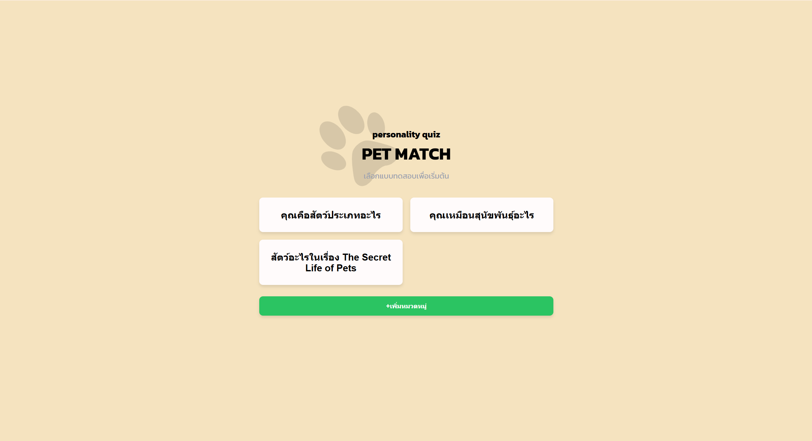

# final2cedt (No Framework, LLM-powered Quiz App)

A personality quiz web app (PET MATCH) built with vanilla HTML/CSS/JS on the frontend and Express + MongoDB on the backend.  
LLM (Gemini) is used to help generate questions and results.

## How to start
1. create ".env" file in backend and key in your own MongoDB URL and gemini api key following the .env-template file.
2. change backend url in frontend config.js file to your backend url.
3. run "npm i" in both frontend folder and backend folder to install the necessary npm modules.

## How to play
1. Click GET STARTED → choose a quiz.
2. Answer each question (use ย้อนกลับข้อที่แล้ว to go back).
3. See your Result (title, description, image) → เล่นอีกครั้ง to restart.

## Create quiz (quick)
1. +เพิ่มหมวดหมู่ → + สร้างแบบทดสอบใหม่
2. ใส่ชื่อหัวข้อ, เพิ่มคำถาม อารมณ์ (X) / รูปลักษณ์ (Y) หรือใช้ปุ่ม ✨ Gen (AI)
3. เพิ่ม Results และเงื่อนไข (X/Y) → ✅ บันทึกแบบทดสอบ

## Notes:
- API endpoints: GET/POST /questions, GET/PUT/DELETE /questions/:id
- If save fails: ensure the backend is running, BACKEND_URL is correct, and MongoDB is reachable.
- Make sure your gemini doesn't exceed its quota.

### What is used in this project.
* Frontend
    - HTML
    - CSS
    - Javascript

* Backend
    - Node.js + Express
    - MongoDB
    - Gemini API

